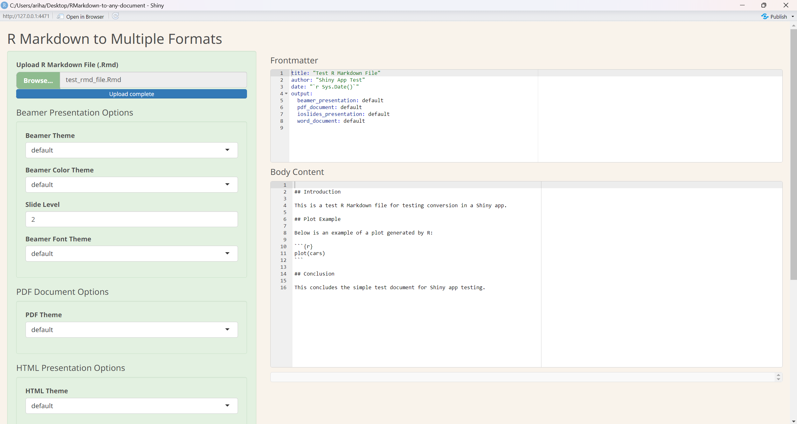

# RmdFormatsHub

RmdFormatsHub is a Shiny app that allows users to convert R Markdown (.Rmd) files into multiple formats with customizable themes and advanced options. It supports formats like Beamer presentations, PDF documents, HTML slides, and Word documents, all while providing flexibility to adjust themes and other document-specific settings.

## Features

- Convert R Markdown (.Rmd) files to:
  - Beamer presentations (PDF)
  - Knitr PDFs
  - HTML presentations (ioslides)
  - Word documents (docx)
- Fully customizable:
  - Choose Beamer themes, slide levels, and font styles.
  - Set color themes for Beamer presentations.
  - Customize PDF document formats and HTML presentation options.
- Live editing of the frontmatter and body content of the R Markdown file.
- Download converted files in a compressed zip format.
- Easy-to-use interface with a clean design and responsive layout.

## Screenshots



## Getting Started

### Prerequisites

- **R (>= 4.0.0)**
- **RStudio** (optional but recommended)
- The following R packages:
  - `shiny`
  - `rmarkdown`
  - `shinyAce`
  - `shinyjs`
  - `zip`
  - `fs`
  - `yaml`

To install the required packages, run the following in your R console:

```r
install.packages(c("shiny", "rmarkdown", "shinyAce", "shinyjs", "zip", "fs", "yaml"))
```

### Installation

1. Clone this repository:

   ```bash
   git clone https://github.com/sachinsancheti1/RmdFormatsHub.git
   ```

2. Navigate to the project directory:

   ```bash
   cd RmdFormatsHub
   ```

3. Open the project in RStudio or launch it directly from the R console:

   ```r
   shiny::runApp()
   ```

### Usage

1. Upload an R Markdown (.Rmd) file.
2. Customize the document options (Beamer theme, PDF style, etc.).
3. Select the output formats you need.
4. Click **Convert** to generate the files.
5. Download the converted files as a zip package.

### Contributing

Contributions are welcome! If you'd like to contribute, please follow these steps:

1. Fork the repository.
2. Create a feature branch (`git checkout -b feature/YourFeature`).
3. Commit your changes (`git commit -m 'Add some feature'`).
4. Push to the branch (`git push origin feature/YourFeature`). 
5. Open a pull request.

### Issues

If you encounter any problems using RmdFormatsHub, please [create an issue](https://github.com/sachinsancheti1/RmdFormatsHub/issues).

### License

This project is licensed under the MIT License - see the [LICENSE](LICENSE) file for details.

## Acknowledgments

- The R community and authors of the `rmarkdown` package.
- Contributors and users who provided valuable feedback.
