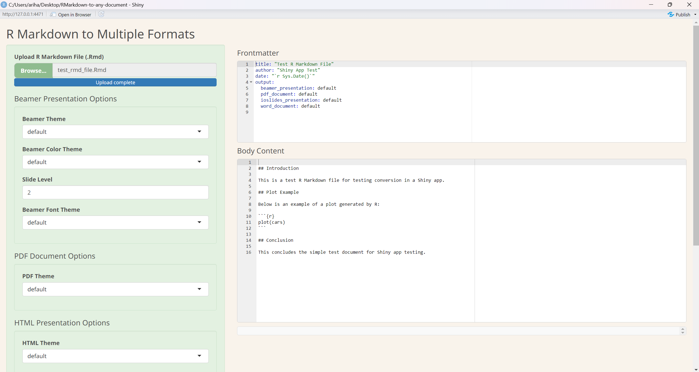

# RmdFormatsHub

RmdFormatsHub is a Shiny app that allows users to convert R Markdown (.Rmd) files into multiple formats with customizable themes and advanced options. It supports formats like Beamer presentations, PDF documents, HTML slides, and Word documents, all while providing flexibility to adjust themes and other document-specific settings.

## Features

- Convert R Markdown (.Rmd) files to:
  - Beamer presentations (PDF)
  - Knitr PDFs
  - HTML presentations (ioslides)
  - Word documents (docx)
- Fully customizable:
  - Choose Beamer themes, slide levels, and font styles.
  - Set color themes for Beamer presentations.
  - Customize PDF document formats and HTML presentation options.
- Live editing of the frontmatter and body content of the R Markdown file.
- Download converted files in a compressed zip format.
- Easy-to-use interface with a clean design and responsive layout.

## Screenshots



## Getting Started

### Prerequisites

- **R (>= 4.0.0)**
- **RStudio** (optional but recommended)
- The following R packages:
  - `shiny`
  - `rmarkdown`
  - `shinyAce`
  - `shinyjs`
  - `zip`
  - `fs`
  - `yaml`

To install the required packages, run the following in your R console:

```r
install.packages(c("shiny", "rmarkdown", "shinyAce", "shinyjs", "zip", "fs", "yaml"))
```

### Installation

1. Clone this repository:

   ```bash
   git clone https://github.com/sachinsancheti1/RmdFormatsHub.git
   ```

2. Navigate to the project directory:

   ```bash
   cd RmdFormatsHub
   ```

3. Open the project in RStudio or launch it directly from the R console:

   ```r
   shiny::runApp()
   ```

### Usage

1. Upload an R Markdown (.Rmd) file.
2. Customize the document options (Beamer theme, PDF style, etc.).
3. Select the output formats you need.
4. Click **Convert** to generate the files.
5. Download the converted files as a zip package.

### Local fallback CLI

The actual per-format rendering (`render_one_format`/`op_convert`) lives in `rmd_core.R`, sourced by `app.R` rather than duplicated inline. It's also directly runnable, for a `.Rmd` too large/sensitive to upload, or to debug a render failure with a real R console instead of just the on-page log:

```bash
Rscript rmd_core.R convert in.Rmd out.zip --formats beamer,knitr,html,word \
  --beamer-theme Madrid --beamer-color whale --beamer-slide-level 2 --beamer-font default \
  --pdf-documentclass report
```

`--formats` is required (comma-separated: `beamer`, `knitr`, `html`, `word`). The Beamer flags and `--pdf-documentclass` are optional (default `default`); `html`/`word` read their theme from the `.Rmd`'s own YAML frontmatter, same as the app's Convert button.

A real bug was caught while building this: the "PDF Theme" dropdown (article/report/book/memoir) wrote `output: pdf_document: theme: ...` into the frontmatter, but `pdf_document` has no `theme` argument at all - selecting anything but "default" silently dropped the PDF output (`unused argument (theme = ...)`, swallowed by the per-format try/catch). Those choices are actually LaTeX document classes, set via the top-level `documentclass` YAML key - but that key is document-wide, so writing it into the shared frontmatter also broke a Beamer conversion in the same batch (its `\documentclass{beamer}` got silently overridden, producing "Undefined control sequence" from every `\begin{frame}`). Fixed by applying `--pdf-documentclass` only as a `pandoc_args` override scoped to the PDF render call itself, never written into the shared `.Rmd`. Verified locally: all 4 formats together, with a non-default Beamer theme *and* a non-default PDF document class at the same time, both via the CLI and end-to-end through the live UI (Playwright).

### Deployment

The app is deployed as a Docker container on [Railway](https://railway.com), behind an nginx reverse proxy that gates it with HTTP Basic Auth. See [DEPLOY.md](DEPLOY.md) for setup details, operating commands, and the non-obvious issues (missing system libraries, TinyTeX/CTAN quirks) hit while getting Beamer/PDF rendering working in the container. Upload cap is 200MB (`shiny.maxRequestSize` in `app.R`, matched by `client_max_body_size 200M` in `nginx.conf.template` - nginx's own default of 1MB sits in front of Shiny and silently 413s anything larger unless both are raised together).

### Contributing

Contributions are welcome! If you'd like to contribute, please follow these steps:

1. Fork the repository.
2. Create a feature branch (`git checkout -b feature/YourFeature`).
3. Commit your changes (`git commit -m 'Add some feature'`).
4. Push to the branch (`git push origin feature/YourFeature`). 
5. Open a pull request.

### Issues

If you encounter any problems using RmdFormatsHub, please [create an issue](https://github.com/sachinsancheti1/RmdFormatsHub/issues).

### License

This project is licensed under the MIT License - see the [LICENSE](LICENSE) file for details.

## Acknowledgments

- Special thanks to the authors and maintainers of the `shiny`, `rmarkdown`, `shinyAce`, `shinyjs`, `yaml`, and other R packages that made this app possible.
- Thanks to the RStudio team for providing an amazing IDE and platform, and the R community for their continuous contributions to open-source.
- A big thank you to the contributors and early users who provided valuable feedback to improve this app.

